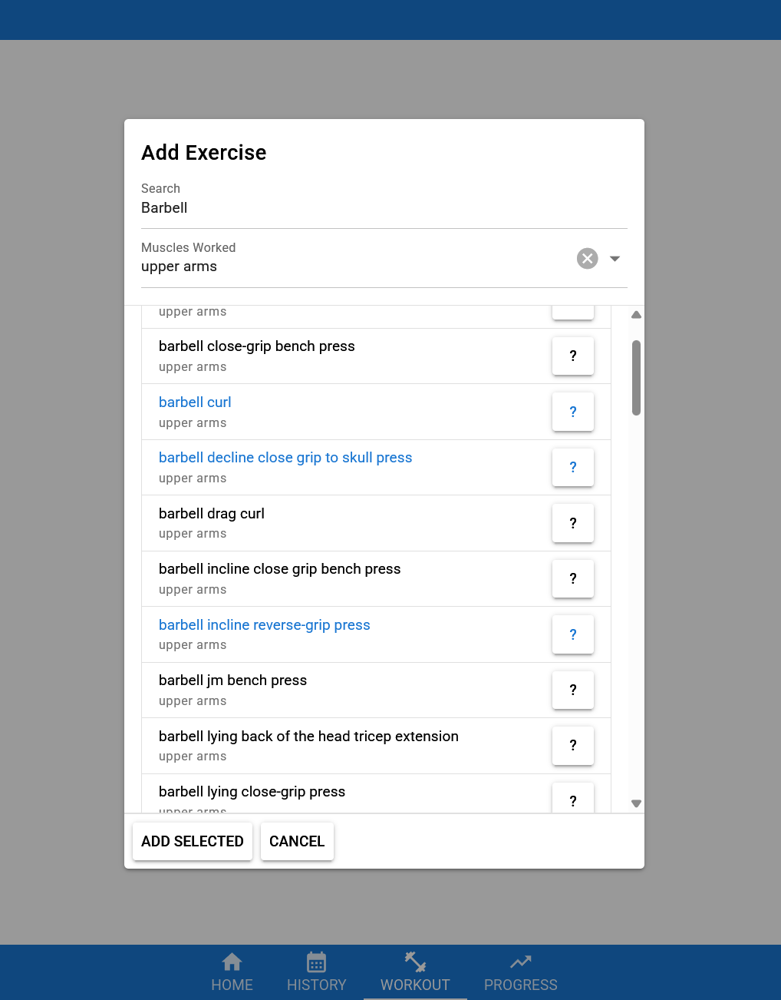
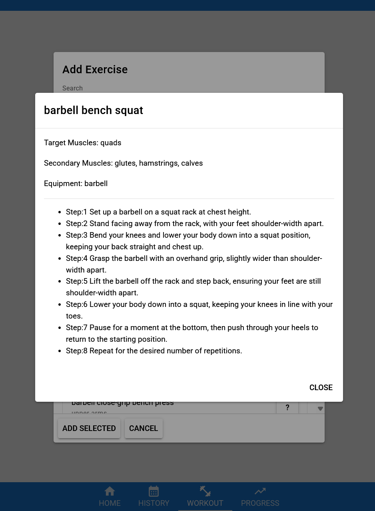

# gym-app

A WIP gym app that plans to track workout/fitness data, and provide the user with insightful data such as graphs to track their progress. All data should be able to be imported or exported to/from local storage so that the app can function entirely offline.

Created using Vue and Quasar.

